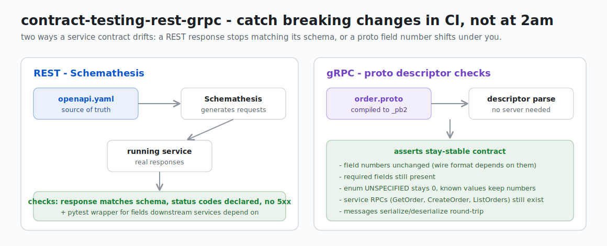

# Contract testing: REST + gRPC

   

Contract testing is about catching breaking API changes before they hit production. When service A depends on service B's API, the question is: if team B changes their contract (renames a field, removes an endpoint, changes a type), when do we find out? Ideally in CI, not at 2am.

This repo covers two flavors I run in my projects: schema-based property testing for REST APIs via Schemathesis, and proto compatibility checks for gRPC services. Neither replaces integration tests, but they catch a whole class of drift bugs that unit tests simply can't see.




## Structure

```
rest/       - OpenAPI contract tests (Schemathesis)
grpc/       - protobuf schema compatibility tests
.github/    - CI workflow that runs both
```

## Quick start

```bash
pip install -r requirements.txt

# REST - run against local service
cd rest && schemathesis run openapi.yaml --base-url http://localhost:8080

# REST - pytest wrapper (useful for CI + custom assertions)
cd rest && pytest test_openapi_contract.py -v

# gRPC - generate stubs, then run proto contract tests
cd grpc && python -m grpc_tools.protoc -I. --python_out=. --grpc_python_out=. order.proto
cd grpc && pytest test_proto_contract.py -v
```

## Notes

The REST tests use Schemathesis to generate requests from the OpenAPI spec and validate that responses match the declared schemas. It finds things like missing required fields in responses, wrong types, undeclared status codes.

The gRPC tests check proto structure: required fields are present, field numbers haven't shifted, service methods haven't disappeared. It's a lighter-weight alternative to buf breaking - no extra tooling needed beyond grpcio-tools.

See subdirectory READMEs for more detail.
